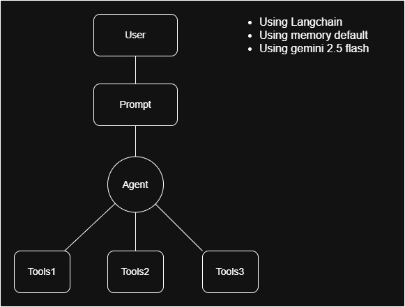
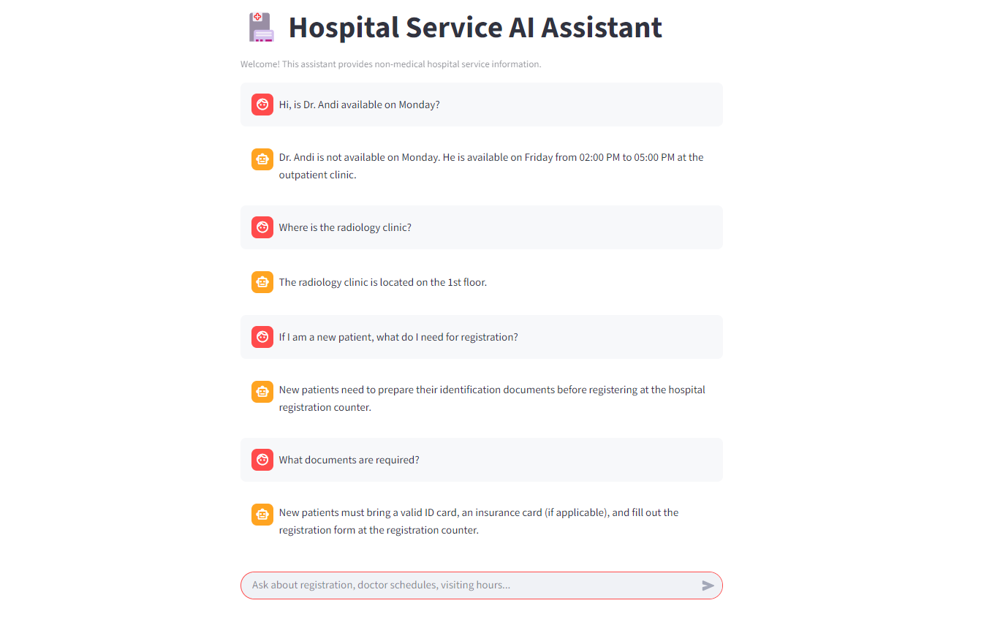

# Hospital-Service-AI-Assistant
This project will develop an AI-based chatbot that assists patients and hospital visitors in obtaining hospital service information quickly, accurately, and efficiently, without replacing the role of medical professionals. With this project, the hospital’s customer service workload can be reduced, responses can be provided quickly 24/7 without waiting for hospital staff to be online, information delivery becomes more consistent, and the system can be easily scaled and developed for production use.

## Use Case
**Target User:**
- New patients: Confused about the registration process
- Returning patients: Looking for doctor schedules (Dr.Andi)
- Patient families: Seeking information about inpatient services
- General visitors: Visiting hours and clinic locations

**Here are some example questions:**
1. New Patients
- “How do I register as a new patient?”
- “What documents do I need to register as a new patient?”
- “Where can I register as a new patient?”
2. Returning Patients
- “What is Dr. Andi’s schedule?”
- “Is Dr. Andi available on Monday?”
- “When is Dr. Andi available this week?”
3. Patient Families
- “What are the visiting hours for inpatients?”
- “What are the rules for inpatient visitors?”
- “Are there any restrictions for inpatient visitors?”
4. General Visitors
- “Where is the cardiology clinic located?”
- “Is there a pharmacy in the hospital?”
- “Where is the emergency department located?”

## Scope Project
**Scope Project Hospital Service AI Assistant And Supporting Technologies**
- AI Agent Architecture: This project uses an AI Agent architecture, where the chatbot does not function merely as a question-and-answer system, but is also capable of analyzing user intent, making decisions, and determining the most appropriate action. The agent acts as the main decision-maker that understands the context of the user’s question, selects the most relevant tool, and then composes a response based on the tool’s output.
- LangChain Framework: LangChain is used as the main framework for developing the chatbot because it provides a modular and well-structured way to build applications based on Large Language Models. Through LangChain, prompts, agents, tools, and memory can be managed separately while remaining fully integrated.
- Large Language Model (Gemini 2.5 Flash): The chatbot uses Gemini 2.5 Flash as its primary language model. This model is chosen for its low latency, meaning fast response times between user queries and system-generated answers. In addition, the model is lightweight and cost-efficient, making it suitable for public service applications such as hospitals that require fast and stable responses.
- Tool-Based System (Dummy Tools): The chatbot system is designed using a tool-based approach, where the agent can call specific functions to retrieve particular information, such as doctor schedules, registration flows, or hospital service details. The tools used in this project are dummy or simulated tools, meaning they are not directly connected to real hospital databases or APIs.
- Single Tool Selection Logic: In each interaction, the agent is restricted to selecting only one tool that is most relevant to the user’s question. This approach encourages more efficient intent analysis and prevents unnecessary tool calls.
- Conversation Memory: The chatbot is equipped with a memory feature that allows the system to remember previous messages within a single interaction session. With memory, the chatbot can provide more contextual and natural responses, as it understands the relationship between consecutive user questions. 
- Prompt Engineering: Prompt engineering is used to control the chatbot’s behavior so that it consistently operates within its defined role and limitations. Through carefully designed prompts, the chatbot is guided to focus on hospital service information and explicitly avoid providing medical diagnoses or medication recommendations.

## System Architecture

The system is designed using an agent-based architecture where user input is first processed by a prompt-guided AI agent. The agent analyzes the user intent and selects exactly one appropriate tool to retrieve relevant information. The tool response is then transformed into a natural language answer and returned to the user.
**Technologies Used:** Python, LangChain, LLM (Gemini 2.5 Flash), Dummy Tools.

## Workflow
1) The system workflow begins when a user submits a question to the chatbot. The question is received by the AI agent, which has been configured with prompts containing the system’s rules, roles, and limitations, particularly within the context of healthcare services.
2) The agent then analyzes the user’s intent to determine the category of information needed, such as doctor schedules, registration procedures, or general questions about hospital services. Based on this analysis, the agent selects the single most relevant tool to use.
3) The selected tool returns data or information that matches the user’s request. This data is then processed by the agent and structured into a clear and natural-language response that is easy to understand. The final answer is sent back to the user as the chatbot’s response.

## Setup & Run
**Environment Setup & Dependencies**
The project environment is set up by installing required Python dependencies with version pinning to ensure compatibility and reproducibility. I used LangChain (v0.1.16) as the main framework for building the AI agent, along with langchain-core (v0.1.53) and langchain-community (v0.0.38) to support agent execution and tool integration. The chatbot is connected to Google’s language model using langchain-google-genai (v0.0.11) and the official google-generativeai (v0.4.1) SDK, enabling interaction with Gemini 2.5 Flash. Environment variables such as API keys are managed using python-dotenv.

**Installation**
To run this project locally, make sure that Python with a compatible version is installed. The execution steps are as follows:
1) Ensure Python (version 3.10 or higher) is installed on your system.
2) Clone this repository to your local machine:
   git clone <repository-url>
   cd hospital_service_ai_assistant
3) Create and activate a virtual environment:
   python -m venv venv
   venv\Scripts\activate
4) Install all required dependencies:
    pip install langchain==0.1.16
    pip install langchain-core==0.1.53
    pip install langchain-community==0.0.38
    pip install langchain-google-genai==0.0.11
    pip installgoogle-generativeai==0.4.1
    pip install python-dotenv
    pip install streamlit
6) Set up environment variables by creating a .env file in the project root:
   GOOGLE_API_KEY=your_google_gemini_api_key (Note: You must use your own Google Gemini API key to run this project.)
7) (Optional) Verify the API key configuration with "check_api.py".
8) Running the Streamlit Application:
   streamlit run web_app.py
   The web application will be available at: http://localhost:8501
9) Once the application is running, the interface appears as shown below.

